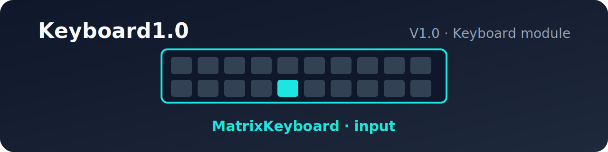

# Keyboard1.0

 

> 版本说明文档 / Version Notes

## 版本信息 / Version Info

| 字段 / Field | 内容 / Content |
| :--- | :--- |
| 版本 / Version | V1.0 |
| 创建时间 / Created | 2026-07-31 |
| 所属模块 / Module | Keyboard |

## 功能说明 / Features

- 仅支持输入
  Input only
