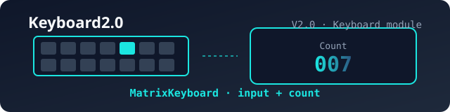

# Keyboard2.0

 

> 版本说明文档 / Version Notes

## 版本信息 / Version Info

| 字段 / Field | 内容 / Content |
| :--- | :--- |
| 版本 / Version | V2.0 |
| 创建时间 / Created | 2026-08-04 |
| 所属模块 / Module | Keyboard |

## 功能说明 / Features

- 键盘输入字符，并实时统计按键次数
  Keyboard character input with real-time keypress counting
- 非可打印字符回退计数，支持纠错
  Non-printable characters decrement the count for correction
