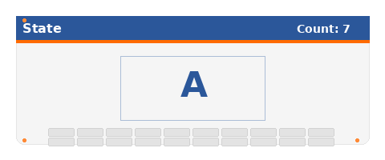

> 版本说明文档 / Version Notes

## 版本信息 / Version Info

| 字段 / Field | 内容 / Content |
| :--- | :--- |
| 版本 / Version | V2.1 Pro |
| 创建时间 / Created | 2026-08-04 |
| 所属模块 / Module | Keyboard |

## 功能说明 / Features

- 蓝色标题栏 + 橙色分隔线，整体 UI 美化
  Blue header bar with orange separator, overall UI polish
- 左上角 State 标签，右上角 Count 计数实时显示
  State label on the top-left, real-time Count on the top-right
- 中间大字号显示当前按键字符（Montserrat 44）
  Large font display of the current key character (Montserrat 44)
- 可打印字符计数 +1，非可打印字符回退计数
  Printable characters increment the count; non-printable characters decrement
