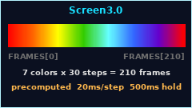

# Screen3.0

> 版本说明文档 / Version Notes

## 版本信息 / Version Info

| 字段 / Field | 内容 / Content |
| :--- | :--- |
| 版本 / Version | V3.0 |
| 创建时间 / Created | 2026-08-06 |
| 所属模块 / Module | Screen |

## 功能说明 / Features

- 7 色彩虹循环（红橙黄绿青蓝紫），RGB 插值平滑过渡
  7-color rainbow cycle with smooth RGB interpolation
- 启动时预计算全部帧序列（210 帧），缓存到 FRAMES 元组，loop 中按索引取色
  Precomputes all 210 frames at startup, caches in FRAMES tuple, indexed lookup in loop
- 每段 30 步过渡，20ms/步，过渡后停留 500ms
  30 steps per segment, 20ms/step, 500ms hold after each transition
- 位运算优化 RGB 拆分与合成
  Bitwise operations for efficient RGB split and combine

*图片仅供参考 / Image for reference only*
