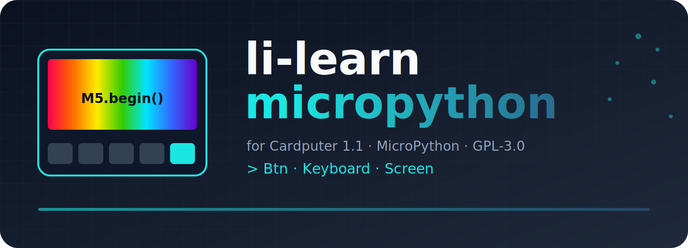

<div align="center">




# li-learn-micropython

为 M5Stack Cardputer 1.1 准备的 MicroPython 学习项目 · A MicroPython learning project for Cardputer 1.1

**[中文](#中文) · [English](#english)**

</div>

---

## 中文

在 M5Stack Cardputer 1.1 上用 MicroPython 逐步练习按键、屏幕、键盘等基础外设。每个功能按版本迭代演进，并配有版本说明文档，方便你追踪学习进度。

### 特性

- **可视化界面**：通过屏幕显示丰富的交互内容
- **外设交互**：学习如何读取按键、键盘输入
- **版本控制**：每个功能都有独立的版本演进历史
- **中英双语**：所有文档均支持中英文双语

### 目录结构

<details>
<summary>点击展开 / Click to expand</summary>

```text
Files
├── Btn           按键模块
│   ├── Btn1.0
│   └── Btn2.0
├── Keyboard      键盘模块
│   ├── Keyboard1.0
│   └── Keyboard2.0
└── Screen        屏幕模块
    └── Screen1.0
```

</details>

### 功能模块

<details>
<summary>点击展开功能模块表格</summary>

| 模块 | 版本 | 功能说明 | 版本文档 |
| :--- | :--- | :--- | :--- |
| Btn | [Btn1.0](Files/Btn/Btn1.0/Btn1.0.py) | 按键 A 点击事件响应，点击后屏幕显示提示文字 | [Ver.md](Files/Btn/Btn1.0/Ver.md) |
| Btn | [Btn2.0](Files/Btn/Btn2.0/Btn2.0.py) | 双击继续交互，带弹跳动画效果 | [Ver.md](Files/Btn/Btn2.0/Ver.md) |
| Keyboard | [Keyboard1.0](Files/Keyboard/Keyboard1.0/Keyboard1.0.py) | 仅支持输入 | [Ver.md](Files/Keyboard/Keyboard1.0/Ver.md) |
| Keyboard | [Keyboard2.0](Files/Keyboard/Keyboard2.0/Keyboard2.0.py) | 键盘输入并实时统计按键次数 | [Ver.md](Files/Keyboard/Keyboard2.0/Ver.md) |
| Screen | [Screen1.0](Files/Screen/Screen1.0/Screen1.0.py) | 屏幕彩虹色循环显示 | [Ver.md](Files/Screen/Screen1.0/Ver.md) |

</details>

### 快速开始

1. 准备一台 M5Stack Cardputer 1.1 设备。
2. 刷入支持 MicroPython 的最新固件。
3. 将 `Files/` 下对应版本的 `.py` 文件上传到设备。
4. 运行即可看到对应效果。

### 许可证

本项目基于 [GPL-3.0](LICENSE) 协议开源。

---

## English

Learn MicroPython step by step on the M5Stack Cardputer 1.1, practicing basic peripherals such as buttons, screen, and keyboard. Each feature evolves by version and ships with its own version notes so you can track your learning progress.

### Features

- **Visual Interface**: Display rich interactive content on the screen
- **Peripheral Interaction**: Learn how to read buttons and keyboard input
- **Version Control**: Each feature has an independent version evolution history
- **Bilingual**: All documents support both Chinese and English

### Directory Structure

<details>
<summary>Click to expand</summary>

```text
Files
├── Btn           Button module
│   ├── Btn1.0
│   └── Btn2.0
├── Keyboard      Keyboard module
│   ├── Keyboard1.0
│   └── Keyboard2.0
└── Screen        Screen module
    └── Screen1.0
```

</details>

### Feature Modules

<details>
<summary>Click to expand the feature modules table</summary>

| Module | Version | Features | Version Notes |
| :--- | :--- | :--- | :--- |
| Btn | [Btn1.0](Files/Btn/Btn1.0/Btn1.0.py) | Button A click response; shows hint text on click | [Ver.md](Files/Btn/Btn1.0/Ver.md) |
| Btn | [Btn2.0](Files/Btn/Btn2.0/Btn2.0.py) | Double-click to continue with bounce animation | [Ver.md](Files/Btn/Btn2.0/Ver.md) |
| Keyboard | [Keyboard1.0](Files/Keyboard/Keyboard1.0/Keyboard1.0.py) | Input only | [Ver.md](Files/Keyboard/Keyboard1.0/Ver.md) |
| Keyboard | [Keyboard2.0](Files/Keyboard/Keyboard2.0/Keyboard2.0.py) | Keyboard input with real-time keypress counting | [Ver.md](Files/Keyboard/Keyboard2.0/Ver.md) |
| Screen | [Screen1.0](Files/Screen/Screen1.0/Screen1.0.py) | Screen cycles through rainbow colors | [Ver.md](Files/Screen/Screen1.0/Ver.md) |

</details>

### Quick Start

1. Prepare an M5Stack Cardputer 1.1 device.
2. Flash the latest MicroPython firmware.
3. Upload the desired `.py` file from `Files/` to the device.
4. Run it to see the result.

### License

This project is open-sourced under the [GPL-3.0](LICENSE) license.
